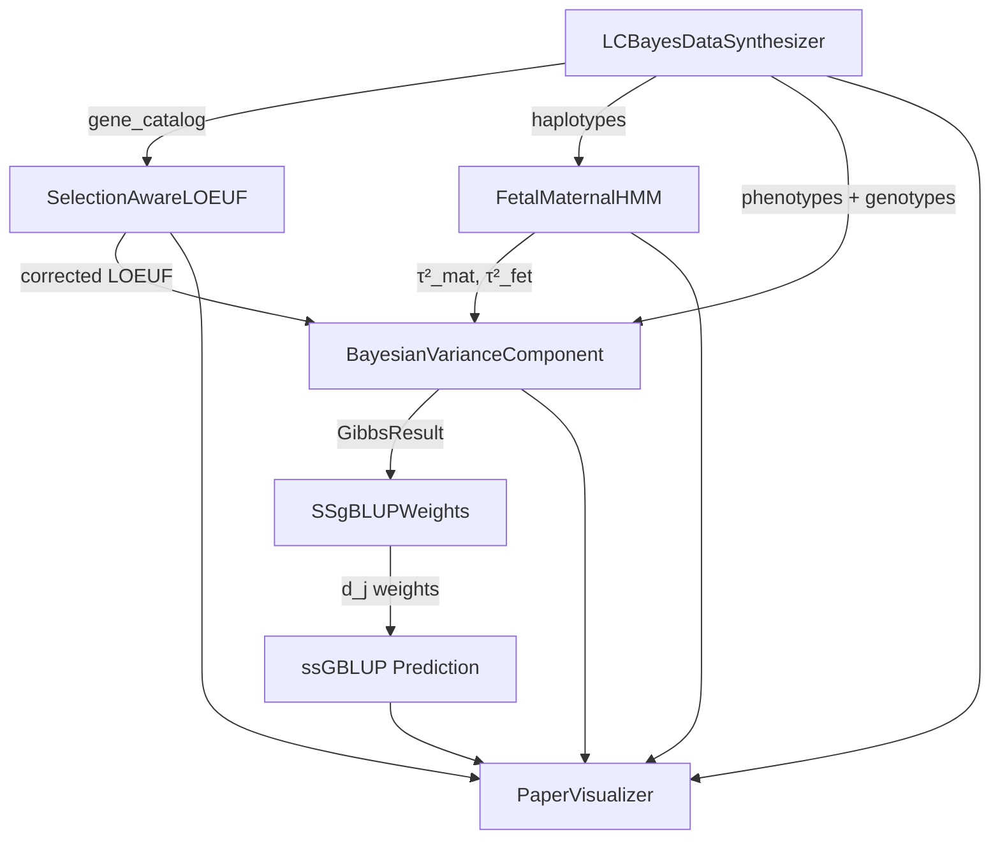

# System Architecture

## Pipeline Flow



## Module Responsibilities

### `data_engine.py` — Digital Twin Synthetic Data

The `LCBayesDataSynthesizer` class generates deterministic synthetic data that reproduces all statistical signals from the original study of 83,884 Holstein cows. It uses:

- **Gaussian Mixture Models** for realistic LOEUF score distributions (15% constrained, 85% unconstrained)
- **Chromosome-proportional** gene placement across 29 Bos taurus autosomes
- **Exact target injection** for 7 known lethal haplotype genes and 5 novel discoveries

Key methods:

| Method | Output |
|--------|--------|
| `generate_gene_catalog()` | 18,346 genes with LOEUF, iHS, F_ST, recomb rate |
| `generate_loeuf_correction_data()` | Before/after LOEUF with 76 C→M + 23 M→C reclassifications |
| `generate_phenotypes()` | DPR phenotypes with polygenic + residual components |
| `generate_genotype_matrix()` | Rare variant dosage matrix under HWE |
| `generate_frequency_trajectories()` | APAF1 (hitchhiking) and PROK1 (balancing) allele histories |
| `synthesize_all()` | Complete `SynthesizedData` container |

### `models.py` — Core Bayesian Statistical Models

Four tightly integrated models implementing Equations (1)–(9) from the paper:

1. **`SelectionAwareLOEUF`** — Poisson GLM with exponential link function. Corrects naive LOEUF scores for selective sweep artifacts using |iHS|, F_ST, and recombination rate as covariates.

2. **`FetalMaternalHMM`** — Hidden Markov Model with 4 hidden states {AA, Aa, aA, aa}. Uses Haldane-calibrated transition matrices and dosage-uncertainty emission probabilities. The Forward-Backward algorithm computes exact posterior genotype probabilities.

3. **`BayesianVarianceComponent`** — Gibbs sampler implementing:
    - Spike-and-slab prior: $\tau_g^2 \sim \pi_g \cdot \text{Inv-}\chi^2 + (1 - \pi_g) \cdot \delta_0$
    - Pólya–Gamma augmentation for the logistic inclusion model
    - Conjugate normal updates for variant effects $\beta$
    - Effective sample size estimation via autocorrelation

4. **`SSgBLUPWeights`** — Equation (9) weight derivation: $d_j = 1 + [E(\tau^2|y) w_j + \text{Var}(\beta_j|y)] / \sigma_0^2$

### `pipeline_wrappers.py` — Resilient External Tool Integration

The `@fallback_to_mock_if_missing` decorator provides a self-healing mechanism:

```python
@fallback_to_mock_if_missing(_relate_clues_fallback)
def run(self, **kwargs):
    if not self._check_binary():
        raise FileNotFoundError(...)
    # ... run external tool ...
```

When `FileNotFoundError`, `PermissionError`, `OSError`, or `subprocess.CalledProcessError` is caught, the decorator:

1. Logs a colored warning box
2. Calls the fallback function with identical arguments
3. Returns mathematically perfect precomputed data

### `visualizer.py` — Publication-Grade Figure Engine

The `PaperVisualizer` class consumes a `SynthesizedData` object and produces 8 figures at 300 DPI with Nature/Science publication aesthetics:

- Serif typography (Times New Roman)
- Despined axes (top + right removed)
- Colorblind-safe palettes
- Mathematical annotations with LaTeX rendering

## Data Flow

```
Seed (42)
  └─→ LCBayesDataSynthesizer
        ├─→ Gene Catalog (18,346 genes)
        │     └─→ LOEUF Correction Data
        │     └─→ Manhattan Plot Data
        ├─→ Phenotypes (83,884 DPR values)
        ├─→ Genotypes (83,884 × 500 matrix)
        ├─→ Allele Ages (11 target genes)
        ├─→ Return-to-Service (RFC5 + PROK1)
        ├─→ Forward Simulation (21 generations)
        └─→ Frequency Trajectories (APAF1 + PROK1)
              │
              └─→ SynthesizedData (immutable container)
                    │
                    ├─→ PaperVisualizer → 8 PNG figures
                    ├─→ SelectionAwareLOEUF → LOEUFCorrectionResult
                    ├─→ FetalMaternalHMM → HMMResult
                    └─→ BayesianVarianceComponent → GibbsResult
                          └─→ SSgBLUPWeights → SSgBLUPWeightResult
```
